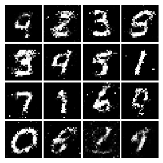
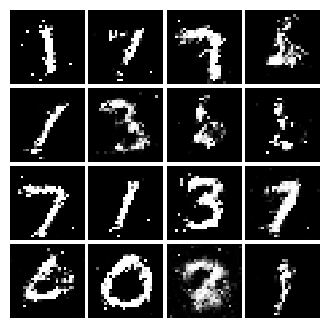
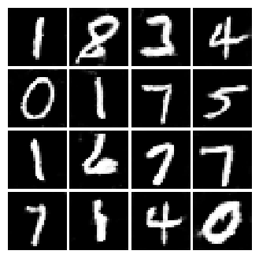

# Image Generation using GAN (Generative Adversarial Networks)

In this notebook, we will expand our repetoire, and build generative models using neural networks. Specifically, we will learn how to build models which generate novel images that resemble a set of training images. 

### What is a GAN?
In 2014, Goodfellow et al. presented a method for training generative models called Generative Adversarial Networks (GANs for short). In a GAN, we build two different neural networks. Our first network is a traditional classification network, called the discriminator. We will train the discriminator to take images, and classify them as being real (belonging to the training set) or fake (not present in the training set). Our other network, called the generator, will take random noise as input and transform it using a neural network to produce images. The goal of the generator is to fool the discriminator into thinking the images it produced are real.

### MNIST Dataset
GANs are notoriously finicky with hyperparameters, and also require many training epochs. In order to make this assignment approachable without a GPU, we will be working on the MNIST dataset, which is 60,000 training and 10,000 test images. Each picture contains a centered image of white digit on black background (0 through 9). This was one of the first datasets used to train convolutional neural networks and it is fairly easy -- a standard CNN model can easily exceed 99% accuracy.

## Discriminator
Our first step is to build a discriminator. Fill in the architecture as part of the nn.Sequential constructor in the function below. All fully connected layers should include bias terms. The architecture is:

- Fully connected layer from size 784 to 256
- LeakyReLU with alpha 0.01
- Fully connected layer from 256 to 256
- LeakyReLU with alpha 0.01
- Fully connected layer from 256 to 1

## Generator
Now to build the generator network:

- Fully connected layer from noise_dim to 1024
- ReLU
- Fully connected layer with size 1024
- ReLU
- Fully connected layer with size 784
- TanH
-- To clip the image to be [-1,1]

## DCGAN Discriminator
In the first part of the notebook, we implemented an almost direct copy of the original GAN network from Ian Goodfellow. However, this network architecture allows no real spatial reasoning. It is unable to reason about things like "sharp edges" in general because it lacks any convolutional layers. Thus, in this section, we will implement some of the ideas from DCGAN, where we use convolutional networks

Discriminator
We will use a discriminator inspired by the TensorFlow MNIST classification tutorial, which is able to get above 99% accuracy on the MNIST dataset fairly quickly.

- Reshape into image tensor (Use Unflatten!)
- 32 Filters, 5x5, Stride 1, Leaky ReLU(alpha=0.01)
- Max Pool 2x2, Stride 2
- 64 Filters, 5x5, Stride 1, Leaky ReLU(alpha=0.01)
- Max Pool 2x2, Stride 2
- Flatten
- Fully Connected size 4 x 4 x 64, Leaky ReLU(alpha=0.01)
- Fully Connected size 1

## DCGAN Generator
For the generator, we will copy the architecture exactly from the InfoGAN paper. See Appendix C.1 MNIST. See the documentation for tf.nn.conv2d_transpose. We are always "training" in GAN mode.

- Fully connected of size 1024, ReLU
- BatchNorm
- Fully connected of size 7 x 7 x 128, ReLU
- BatchNorm
- Reshape into Image Tensor
- 64 conv2d^T filters of 4x4, stride 2, 'same' padding, ReLU
- BatchNorm
- 1 conv2d^T filter of 4x4, stride 2, 'same' padding, TanH
- Should have a 28x28x1 image, reshape back into 784 vector

## Results

### Vanilla GAN

| Iter | D loss | G loss |
|   :---:| :---:    |  :---:    |
| 3750 | 1.451 | 0.8231 |

### Least Squares GAN

| Iter | D loss | G loss |
|   :---:| :---:    |  :---:    |
| 3750 | 0.239 | 0.165 | 

### Deeply Convolutional GAN

| Iter | D loss | G loss |
|   :---:| :---:    |  :---:    |
| 3750 | 0.9103 | 1.15 |

## References

[cs231n: Deep Learning for Computer Vision](http://cs231n.stanford.edu/)
